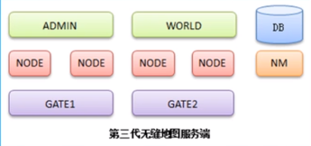

## 第一代游戏服务器
MUD1:mudOS
C语言/单线程无阻塞套接字
主线程每秒更新一次所有对象
房间形式
telnet客户端通过tcp连接到MUDOS,纯文字游戏，指令用回车分割
数据存在文件中
每台4000人同时
内容LPC定制
## 第二代游戏服务器
数据存储瓶颈
GAME-->DB
## 第二代游戏服务器II
单线程瓶颈
GAME WORLD1|GAME WORLD2-->DB
## 第二代游戏服务器III
数据库访问瓶颈
GAME WORLD1|GAME WORLD2-->代理-->DB
## 第二代游戏服务器IV
GAME WORLD1|GAME WORLD2-->代理-->DB
-----------------------
         GATE          |
-----------------------
玩家  玩家  玩家  玩家  玩家
## 第二代游戏服务器V
玩法和玩家过多
管理  聊天 交易
GAME WORLD1|GAME WORLD2-->代理-->DB
                            |--->DB2
-----------------------
    GATE   GATE2       |
-----------------------
玩家  玩家  玩家  玩家  玩家
## 第三代游戏服务器

多线程死锁
代码重用
大规模并发
帧同步
## 第四代网络游戏服务器
