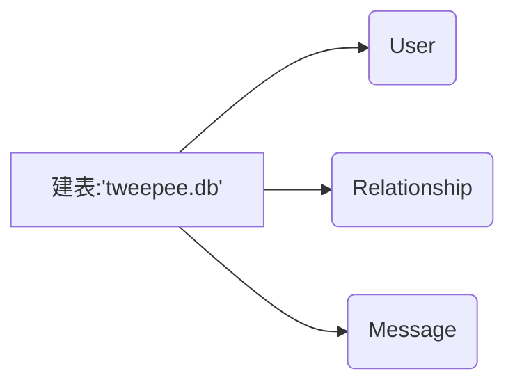
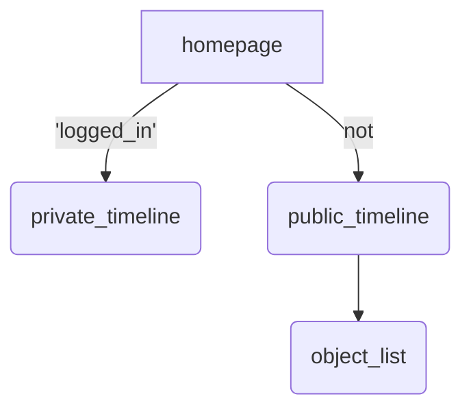
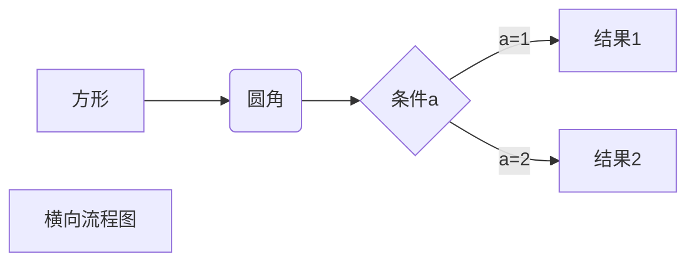

# FLASK

要使用cmd，shell不太行
```sh
set FLASK_APP=hello.py
flask run
```
## 梳理一下demo的流程

create_tables()建表

'tweepee.db'：User, Relationship, Message

run了
 homepage()主页
      /
      /
 private_timeline




## 设计一个关系型数据库

帖子ID --> 帖子名称
帖子ID --> 帖子跟帖
帖子ID --> 最新更新时间
帖子ID --> 最初发表时间
帖子跟贴--> 发表时间




## 一些网络响应的问题
http方法分两种  GET 和POST
两种形式
[HTTP 方法：GET 对比 POST](https://www.w3school.com.cn/tags/html_ref_httpmethods.asp)
使用浏览器访问使用的是get方法
get的请求直接放在访问的url中，而post需要放在一个信息主体内

http请求要区分http和https，后者需要进行身份验证，如果没有使用https，就应该使用http
