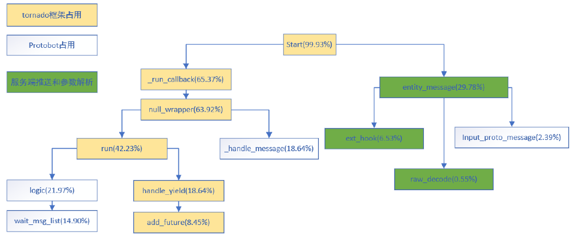

滕岳    2020-10-26 19:51:17
后面可以着重看下Robot的具体结构
滕岳    2020-10-26 19:51:22
包括哪些属性、哪些方法
滕岳    2020-10-26 19:51:39
包括call_server_method的实现，wait_method_call的实现
滕岳    2020-10-26 19:51:58
还有rpc callback的调用过程

## ex
### 报错has no attribute 'avatar_time'(2020.11.09)
case中初始化中如果没有
        self.avatar_time = 0
        self.first_start = 0
那么在
        self.currententity.call_server_method('gmInput', {'m': 'add_all_heroes'})
的时候就会报错：

=========================== Traceback start ===========================
Traceback (most recent call last):
  File "/project/G58na/case/module/login_module.py", line 27, in logic
    if self.case.avatar_time == 0:
AttributeError: 'FightYZXCase' object has no attribute 'avatar_time'
=========================== Traceback end ===========================
### 第二个call_server_method无响应因为r的值重复(2020.11.09)
call_server_method的参数中'r'值不能一直为一个数，重复call_server_method时，可对r值加1处理
    self.currententity.call_server_method(
        'reliableRpcCall', {
            'w': {
                'm': 'combatOfflineRequest', 'p': {
                    't': 1, 'm': 9, 's': mission_id , 'h': [2], 'd': {}, 'cm': '', 'mc': 1}, 'r': r_ID}})

### 疯狂reliableRpcCall因为s和r的值不一致(2020.11.09)
self.currententity.call_server_method('reliableRpcCall', {'w': {'m': 'combatOfflineRequest', 'p': {'t': 1, 'm': 9, 's': mission_id , 'h': [2], 'd': {}, 'cm': '', 'mc': 1}, 'r': r_ID}})
self.currententity.call_server_method('reliableRpcAck', {'s': r_ID})
这两句话的s和r的值要保持一致

